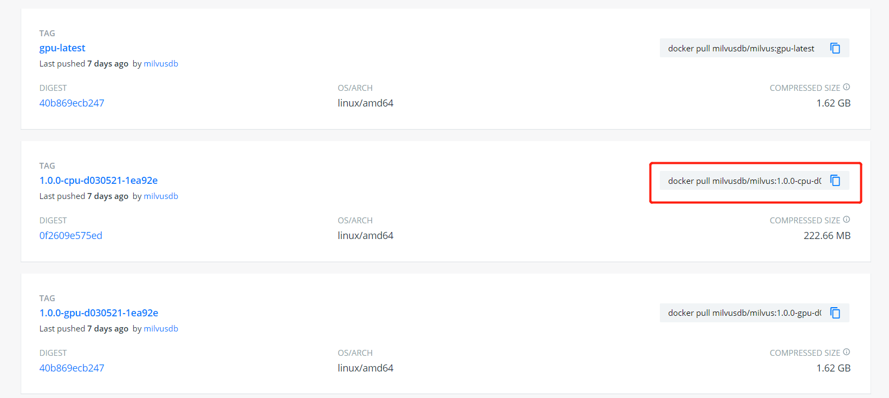
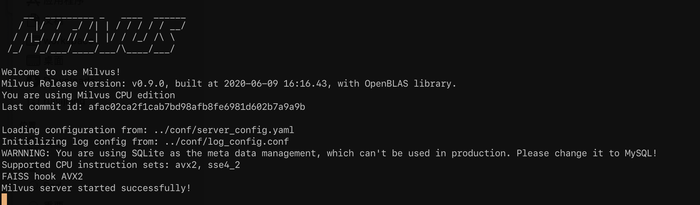

summary: How to install cpu-only milvus in minutes
id: how-to-install-cpu-only-milvus-in-minutes
categories: milvus
tags: installation
status: Published
authors: Brother Long
Feedback Link: https://github.com/milvus-io/milvus

# How to Install CPU-only Milvus in minutes

## Prerequisites
Duration: 1

### Operating system requirements

| Operating system | Supported versions                                                      |
| :--------------- | :---------------------------------------------------------------------- |
| CentOS           | 7.5 or higher                                                           |
| Ubuntu LTS       | 18.04 or higher                                                         |
| Windows          | Windows 10 64-bit: Pro, Enterprise, or Education (Build 15063 or later) |
| macOS            | 10.13 or higher                                                         |


### Hardware requirements

| Component           | Recommended configuration                              |
| ------------------- | ------------------------------------------------------ |
| CPU                 | Intel CPU Sandy Bridge or higher.                      |
| CPU instruction set | <li>SSE42</li><li>AVX</li><li>AVX2</li><li>AVX512</li> |
| RAM                 | 8 GB or more (depends on the data volume)              |
| Hard drive          | SATA 3.0 SSD or higher                                 |

## Install Docker
Duration: 3
- If you're using Ubuntu or CentOS, [Install Docker](https://docs.docker.com/engine/installation/linux/docker-ce/ubuntu/) 19.03 or higher on your local host machine.
- If you're installing Milvus on Windows, install [Docker Desktop](https://docs.docker.com/docker-for-windows/install/), and make certain configurations in **Settings > Advanced**. Make sure the Memory available to Docker Engine exceeds the sum of `insert_buffer_size` and `cpu_cache_capacity` you set in the `server_config.yaml` file.
- If you're installing Milvus on macOS, install [Docker Desktop for Mac](https://docs.docker.com/docker-for-mac/install/), and make certain configurations in **Settings > Advanced**. Make sure the Memory available to Docker Engine exceeds the sum of `insert_buffer_size` and `cpu_cache_capacity` you set in the `server_config.yaml` file.

## Confirm Docker status
Duration: 1

Confirm that the Docker daemon is running in the background:

```shell
$ docker info
```

If you do not see the server listed, start the **Docker** daemon.

> Note: On Linux, Docker needs sudo privileges. To run Docker command without `sudo`, create the `docker` group and add your user. For details, see the [post-installation steps for Linux](https://docs.docker.com/install/linux/linux-postinstall/).

## Select Milvus version from Docker hub
Duration: 4

Go to [dockerhub](https://hub.docker.com/r/milvusdb/milvus/tags), ensure which version of milvus are you going to install. Click the copy button. Full docker pull command will be copied.



## Pull Milvus Image
Paste the command in your console window

```shell
$ docker pull milvusdb/milvus:1.0.0-cpu-d030521-1ea92e
```

## Create Milvus directories
Duration: 1

Create 4 directories for milvus, we will mount these directories into the container later, you can place these folder anywhere, now, we put it at home directory.
- db: vectors will be stored in this directory
- logs: any milvus running logs will be here
- wal: wal will be stored in this directory
- conf: configuration files will be stored in this directory

```shell
$ mkdir -p /home/$USER/milvus/db
$ mkdir -p /home/$USER/milvus/logs
$ mkdir -p /home/$USER/milvus/wal
$ mkdir -p /home/$USER/milvus/conf
```

## Download configuration files
Duration: 2

Download the standard milvus configuration file, place it in the conf directory you just created.

```shell
$ cd /home/$USER/milvus/conf
$ wget https://raw.githubusercontent.com/milvus-io/milvus/v1.0.0/core/conf/demo/server_config.yaml
```

> Note: In case you encounter problems downloading configuration files using `wget` command, you can also create `server_config.yaml` under `/home/$USER/milvus/conf`, then copy and paste the content from [server config file](https://github.com/milvus-io/milvus/blob/v1.0.0/core/conf/demo/server_config.yaml).


## Start Milvus
Duration: 1

Run the docker that we just pulled. We will map the ports and mounts directories we just created.
- Milvus default port is 19530
- Milvus default http port is 19121

```shell
$ docker run --name milvus_cpu_1.0.0 \
-p 19530:19530 \
-p 19121:19121 \
-v /home/$USER/milvus/db:/var/lib/milvus/db \
-v /home/$USER/milvus/conf:/var/lib/milvus/conf \
-v /home/$USER/milvus/logs:/var/lib/milvus/logs \
-v /home/$USER/milvus/wal:/var/lib/milvus/wal \
milvusdb/milvus:1.0.0-cpu-d030521-1ea92e
```

You can see someting like this, and we are done


If you want run milvus in the background, add option '-d'
```shell
$ docker run -d --name milvus_cpu_1.0.0 \
-p 19530:19530 \
-p 19121:19121 \
-v /home/$USER/milvus/db:/var/lib/milvus/db \
-v /home/$USER/milvus/conf:/var/lib/milvus/conf \
-v /home/$USER/milvus/logs:/var/lib/milvus/logs \
-v /home/$USER/milvus/wal:/var/lib/milvus/wal \
milvusdb/milvus:1.0.0-cpu-d030521-1ea92e
```

### Next
* You can [Try a example program](https://milvus.io/docs/guides/get_started/example_code.md)
* Learn more [about milvus](https://milvus.io/docs/about_milvus/overview.md)
* [Give milvus a star if you like it](https://github.com/milvus-io/milvus)
